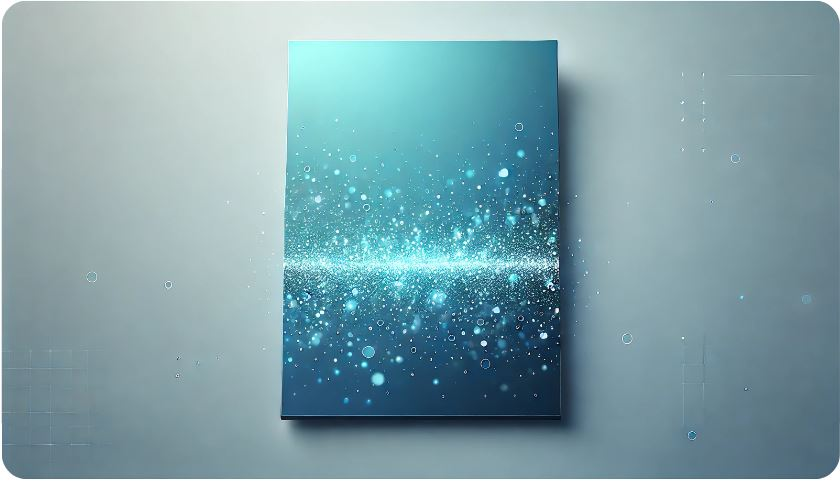

# ✨ Crear Particulas


Este proyecto es una animación interactiva de partículas en un fondo minimalista, ideal para sitios web o aplicaciones que busquen un efecto visual moderno y dinámico.

## 📄 Descripción

El proyecto consiste en un fondo de color azul claro con partículas blancas flotando de manera sutil, creando un ambiente futurista y digital. La animación de partículas está controlada por los archivos JavaScript (`app.js` y `particles.js`) y está estilizada con CSS (`style.css`). 

## 📂 Archivos del Proyecto

- `index.html`: Contiene la estructura HTML básica, junto con el contenedor de partículas (`<div id="particles-js">`), que es donde se renderizan las partículas.
- `style.css`: Establece los estilos de la página, como el color de fondo azul claro (`#08ceff`), y asegura que el fondo y las partículas se ajusten a toda la pantalla.
- `particles.js` y `app.js`: Controlan el comportamiento y propiedades de las partículas, como su número, tamaño, color y forma. Utiliza configuraciones personalizadas para crear un efecto visual limpio y equilibrado.

## 🚀 Cómo Usarlo

1. Clona este repositorio en tu máquina local:
   ```bash
   git clone <URL_del_repositorio>

2. Abre el archivo `index.html` en un navegador para ver la animación de partículas en acción.

## 📦 Dependencias

El proyecto utiliza `particles.js`, una biblioteca JavaScript que facilita la creación de animaciones de partículas. **No es necesario instalarla por separado, ya que los archivos `particles.js` y `app.js` ya están incluidos en el proyecto.**

## 🎨 Personalización

Para cambiar el número, color o tamaño de las partículas, abre el archivo `app.js` y ajusta las propiedades dentro de la sección `"particles"`:

```bash
"particles": {
  "number": {
    "value": 80,  // Número de partículas
    "density": {
      "enable": true,
      "value_area": 800
    }
  },
  "color": {
    "value": "#ffffff"  // Color de las partículas
  },
  "shape": {
    "type": "circle"
  }
}
```

## 🖼️ Captura de Pantalla

## 🙏 Créditos
- Proyecto original basado en `particles.js`.
- Desarrollado para un entorno minimalista y visualmente atractivo.

